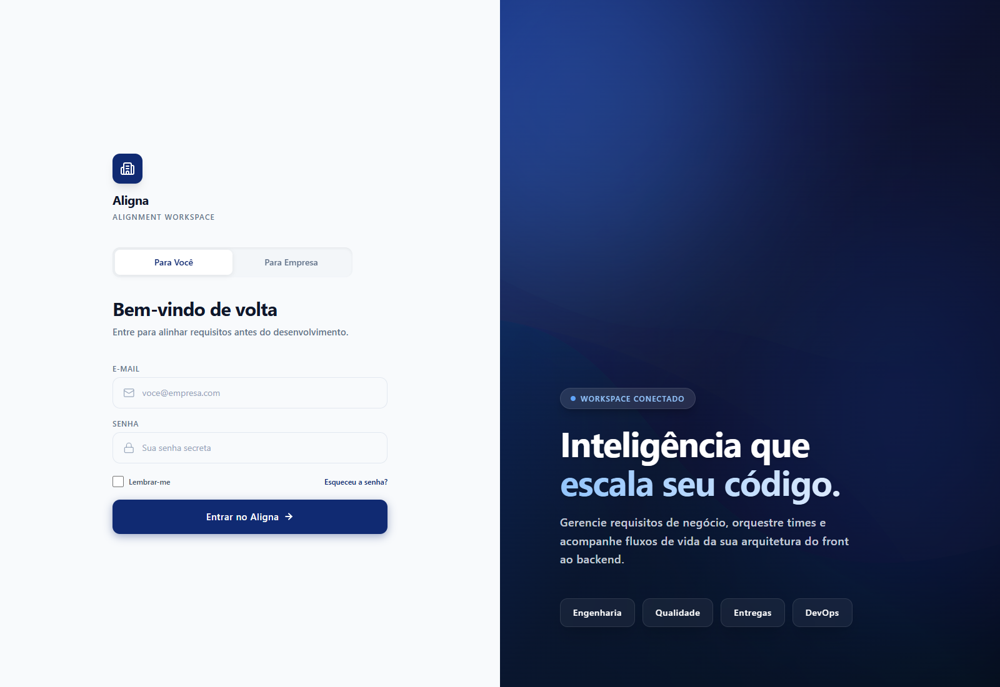
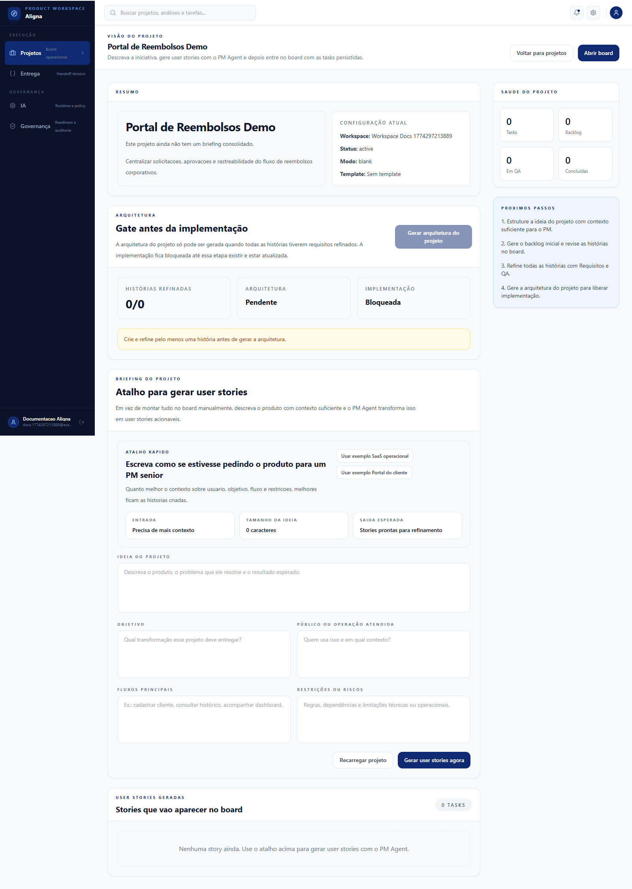
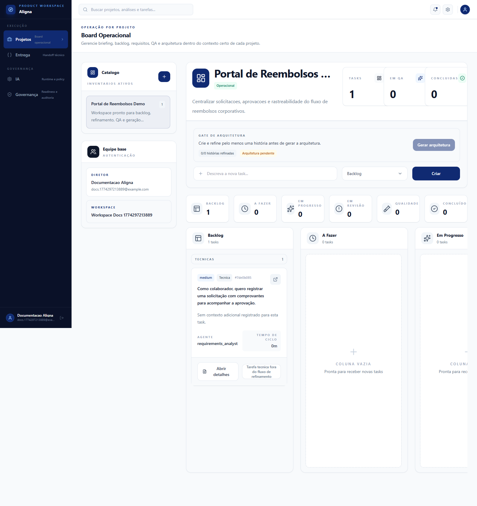
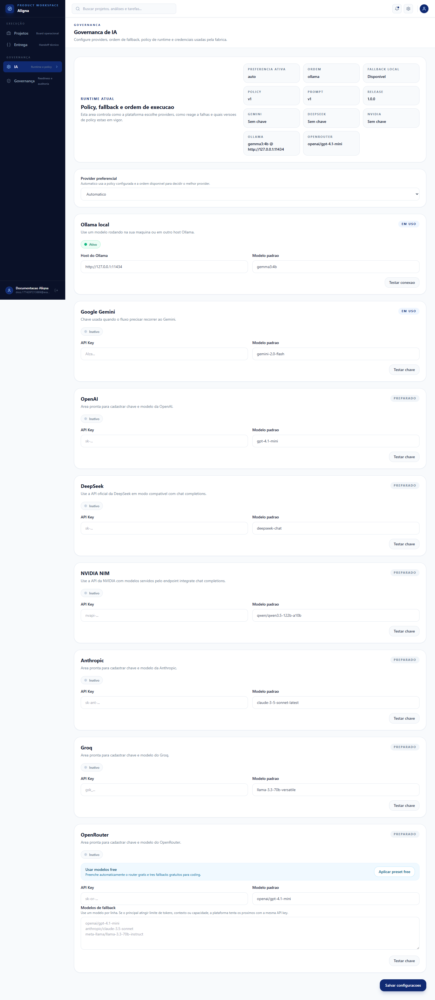

# Aligna Comercial

Versão orientada a posicionamento, valor de negócio e narrativa de venda do produto.

## One-liner

O Aligna transforma ideias vagas em requisitos claros, testáveis e prontos para execução antes do desenvolvimento começar.

## Elevator pitch

A maior parte do retrabalho em software nasce antes do código. O Aligna resolve esse problema organizando o caminho entre ideia, requisito, QA e arquitetura em um fluxo operacional único. Em vez de depender de documentos soltos, interpretações diferentes e validações tardias, o time trabalha com stories refinadas, regras de negócio explícitas, critérios de aceite e cenários de teste desde o início.

## O problema que o Aligna resolve

Times de produto, tecnologia e operação normalmente convivem com:

- requisitos vagos
- histórias de usuário mal definidas
- critérios de aceite incompletos
- regras de negócio implícitas
- QA entrando tarde no processo
- retrabalho entre produto, engenharia e validação

O resultado é previsível:

- atraso
- desalinhamento
- correções caras
- baixa confiança para implementar

## A proposta de valor

O Aligna ajuda empresas a sair do “briefing subjetivo” para um fluxo mais confiável de entrega.

### O que a plataforma entrega

- backlog inicial com épicos, stories e tarefas técnicas
- refinamento de requisitos por história
- critérios de aceite mais claros
- plano de testes gerado no mesmo fluxo
- gate de arquitetura antes da implementação
- governança de IA com fallback entre providers

### Benefícios para o negócio

- menos retrabalho antes do desenvolvimento
- mais clareza para priorização
- melhor comunicação entre produto, engenharia e QA
- redução de ambiguidade nas decisões
- maior previsibilidade para iniciar implementação

## Para quem o produto faz sentido

### Público principal

- software houses
- squads de produto
- consultorias de tecnologia
- equipes de operação com backlog crescente
- empresas que precisam formalizar melhor a etapa de discovery e handoff

### Perfis que mais se beneficiam

- Product Managers
- Product Owners
- Tech Leads
- QA Leads
- Heads de Delivery
- Founders de startups B2B SaaS

## Como o produto funciona

### 1. O time registra a iniciativa

O usuário cria um projeto e descreve:

- a ideia
- o objetivo
- o público
- os fluxos principais
- as restrições do contexto

### 2. O sistema gera o backlog inicial

O Aligna transforma esse briefing em:

- épicos
- histórias de usuário
- tarefas técnicas iniciais

### 3. Cada story entra no fluxo de qualidade

As histórias seguem para:

- refinamento de requisitos
- geração de critérios e regras
- geração de plano de testes

### 4. A arquitetura entra como gate

A implementação só avança quando o projeto já tem base suficiente para isso. Esse ponto aumenta a confiança técnica e reduz aceleração prematura com requisito incompleto.

## Diferenciais competitivos

O Aligna não é apenas uma tela para escrever requisitos nem apenas um chat de IA.

### Diferenciais

- workflow operacional completo, não só geração de texto
- backlog, requisitos, QA e arquitetura no mesmo fluxo
- persistência por projeto e por task
- board com status e responsabilidade por agente
- governança de runtime de IA
- fallback entre múltiplos providers
- suporte a modelos locais e remotos

### O que isso significa na prática

Enquanto muitas ferramentas entregam “uma resposta”, o Aligna entrega processo, estrutura e continuidade operacional.

## Posicionamento

O Aligna deve ser apresentado como:

**uma plataforma de alinhamento e preparação para entrega de software**

e não como:

- apenas um gerador de user stories
- apenas um copiloto de requisitos
- apenas uma software factory genérica

## Mensagens de venda

### Versão executiva

O Aligna reduz o custo do desalinhamento antes que ele vire atraso de entrega.

### Versão para produto

O Aligna ajuda o time a sair de briefings vagos para histórias e critérios que engenharia e QA conseguem executar com mais confiança.

### Versão para tecnologia

O Aligna cria uma ponte mais segura entre intenção de negócio, requisito refinado, validação e gate técnico antes do código.

## Casos de uso ideais

- estruturar um novo produto antes da implementação
- transformar briefing comercial em backlog inicial
- preparar discovery para squads de entrega
- padronizar refinamento de stories
- incorporar QA mais cedo no ciclo
- reduzir ambiguidades em projetos sob pressão

## Modelo de valor percebido

O produto tende a gerar valor principalmente por:

- economia de tempo de refinamento
- menor volume de retrabalho
- melhor qualidade de handoff
- menor risco de interpretação divergente
- ganho de velocidade com mais previsibilidade

## Capturas de tela

### Entrada e autenticação

### Briefing e geração de stories

### Board operacional

### Governança de IA

## Prova de capacidade

O produto atual já demonstra:

- autenticação com workspace
- board operacional por projeto
- geração de backlog por agente
- refinamento por story
- geração de QA por story
- gate de arquitetura
- configuração de providers e fallback de IA

Isso permite apresentar o Aligna não só como conceito, mas como plataforma funcional em evolução.

## Forma recomendada de apresentar o produto

### Frase principal

O Aligna organiza o que precisa ficar claro antes da implementação começar.

### Sequência de demo

1. mostrar a criação e entrada no workspace
2. mostrar a visão do projeto
3. gerar ou explicar a geração de user stories
4. abrir o board operacional
5. mostrar o fluxo de requisitos e QA
6. fechar com governança de IA e gate de arquitetura

## Materiais complementares

- [SYSTEM_DOCUMENTATION.md](./SYSTEM_DOCUMENTATION.md)
- [ALIGNA_ARCHITECTURE.md](./ALIGNA_ARCHITECTURE.md)
