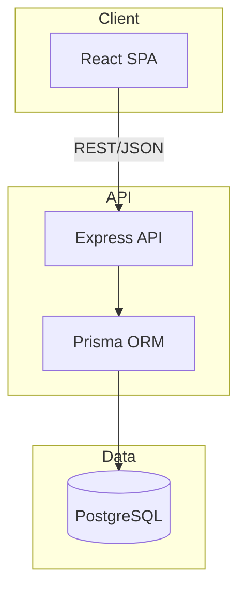

# ARQUITETURA DO PROJETO

## Visão Geral
Plataforma web para operação de visitas corporativas, cobrindo criação, aprovação, preparação, recepção e consulta histórica.
O foco do MVP é reduzir falhas operacionais, dar rastreabilidade básica e apoiar recepção, segurança e gestores sem inflar a stack nem o domínio cedo demais.

## Stack Tecnológico
- **Frontend**: React 18 + TypeScript + Vite
- **Backend**: Node.js 20 + Express 4
- **ORM**: Prisma 5
- **Banco**: PostgreSQL 15
- **Auth**: JWT + RBAC
- **Infra**: Docker + docker-compose
- **Logs**: stdout estruturado
- **Health**: `GET /health`

## Módulos e Responsabilidades
| Módulo | Responsabilidade | Entidades Principais |
|---|---|---|
| **Visits** | Criação da visita, escopo básico, dados principais, status e reagendamento | Visit, VisitScope |
| **Guests** | Cadastro de visitantes, acompanhantes e vínculo com visitas aprovadas | Guest, VisitGuest, ExtraCompanion |
| **Approvals** | Fluxo de aprovação, justificativas, prazos e regras operacionais | Approval, ApprovalRule, ApprovalDeadline |
| **Operations** | Responsável operacional e recursos essenciais para preparar a visita | OperationalLead, SupportResource |
| **History** | Consulta de histórico de visitas recorrentes e reaproveitamento de contexto | VisitHistorySnapshot, RecurringClientProfile |
| **Security** | Bloqueios e ocorrências operacionais que afetam aprovação ou entrada | BlockedGuest, IncidentReport |
| **Notifications** | Alertas operacionais e lembretes de aprovação ou visita | NotificationLog, NotificationRule |
| **Identity & Access** | Autenticação e papéis internos da plataforma | User, Role, Permission |

## Diagrama de Arquitetura


## Estrutura de Diretórios Sugerida
```text
plataforma-operacoes-visitas/
|-- apps/
|   |-- web/
|   |   |-- src/
|   |   |   |-- app/
|   |   |   |-- features/
|   |   |   |-- shared/
|   |   |   `-- App.tsx
|   |   `-- vite.config.ts
|   `-- api/
|       |-- src/
|       |   |-- modules/
|       |   |-- middleware/
|       |   |-- lib/
|       |   `-- server.ts
|       `-- package.json
|-- packages/
|   |-- shared/
|   `-- ui/
|-- prisma/
|   `-- schema.prisma
`-- docker-compose.yml
```

## Modelo de Dados e Entidades Principais
```prisma
model Visit {
  id              String   @id @default(cuid())
  title           String
  objective       String?
  scheduledAt     DateTime
  estimatedEndAt  DateTime?
  status          VisitStatus
  scopeFormat     String?
  scopeVolume     Int?
  context         String?
  createdAt       DateTime @default(now())
  updatedAt       DateTime @updatedAt

  guests          VisitGuest[]
  extraCompanions ExtraCompanion[]
  approvals       Approval[]
  operationalLead OperationalLead?
}

model VisitGuest {
  id          String   @id @default(cuid())
  name        String
  contact     String?
  document    String?
  company     String?
  visitId     String
  visit       Visit    @relation(fields: [visitId], references: [id])
}

model ExtraCompanion {
  id          String   @id @default(cuid())
  name        String
  fastTrack   Boolean  @default(false)
  visitId     String
  visit       Visit    @relation(fields: [visitId], references: [id])
}

model Approval {
  id            String         @id @default(cuid())
  status        ApprovalStatus
  justification String?
  decidedAt     DateTime?
  visitId       String
  visit         Visit          @relation(fields: [visitId], references: [id])
}

model OperationalLead {
  id          String @id @default(cuid())
  name        String
  contact     String
  supportType String
  visitId     String @unique
  visit       Visit  @relation(fields: [visitId], references: [id])
}

enum VisitStatus {
  DRAFT
  PENDING_APPROVAL
  APPROVED
  IN_PROGRESS
  COMPLETED
  CANCELLED
}

enum ApprovalStatus {
  PENDING
  APPROVED
  REJECTED
}
```

Observações de modelagem:
- `Visit` é o agregado central do MVP.
- `OperationalLead` fica 1:1 com a visita para refletir o responsável principal do preparo.
- `ExtraCompanion` existe como extensão de uma visita já aprovada, sem virar um módulo independente cedo demais.
- Snapshots de histórico e regras de notificação podem começar fora do schema principal se nascerem primeiro como leitura derivada.

## Contratos e Integrações
- **REST API** em `/api`
- Contratos principais do MVP:
  - `POST /visits`
    - cria visita com dados principais e escopo básico
  - `PATCH /visits/:id`
    - atualiza agenda, contexto ou status permitido
  - `POST /visits/:id/guests`
    - adiciona visitante principal ou complementar
  - `POST /visits/:id/extra-companions`
    - anexa acompanhantes extras em visita aprovada
  - `POST /visits/:id/approvals`
    - registra decisão de aprovação com justificativa
  - `GET /visits/:id/history`
    - retorna histórico resumido para reaproveitamento operacional
  - `POST /visit-operational-responsibles`
    - cadastra responsável operacional com nome, contato e tipo de suporte
- **Integrações externas**:
  - nenhuma integração física é obrigatória no MVP
  - notificação pode iniciar como registro interno ou fila simples
  - badge, QR code, impressão, webhook e exportação ficam para fase posterior

## Padrões de Design
- **Module-first monolith**: cada módulo concentra router, service e contratos do próprio slice.
- **Service Layer**: regras de domínio ficam em services, sem espalhar regra em controllers.
- **Thin HTTP layer**: Express valida entrada, chama service e devolve resposta.
- **Shared contracts**: tipos de request e response compartilhados entre web e API.
- **Feature slices no frontend**: cada feature concentra page, service e estado local, reduzindo acoplamento entre telas.

## Observabilidade e Operação
- Logs estruturados com `timestamp`, `level`, `action`, `entity`, `entityId`
- `GET /health` com status da API e conectividade com banco
- Métricas mínimas:
  - visitas criadas no dia
  - aprovações pendentes
  - tempo médio de aprovação
- Auditoria mínima:
  - criação e alteração de visita
  - decisões de aprovação
  - cadastro de responsável operacional

## Estratégia de Deploy
- Ambiente único com Docker Compose
- API e Web publicados atrás de proxy reverso simples
- Pipeline básico: install, lint, build, test, deploy
- Banco PostgreSQL com backup simples e restore testado por script

## Segurança
- JWT para autenticação
- RBAC para papéis internos
- Audit log para mudanças sensíveis de aprovação e visita
- Rate limit nas rotas de autenticação e escrita
- Proteção de dados sensíveis por minimização de coleta antes de investir em cifragem mais pesada

## Riscos Técnicos e Trade-offs
- **Monólito modular**: mais simples para o MVP, mas exige disciplina de fronteira entre módulos
- **Histórico e notificação**: podem crescer rápido; manter contratos simples no início reduz retrabalho
- **Integrações físicas**: badge, QR code e impressão só entram quando houver demanda real no backlog
- **RBAC completo cedo demais**: manter papéis essenciais primeiro evita transformar o MVP em plataforma de IAM
